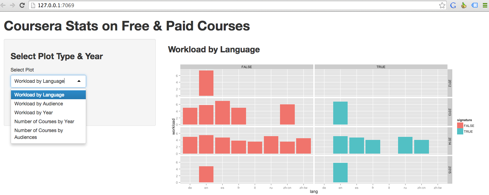

Free vs. Paid Courses
========================================================
author: Igor Protsenko
date: Sep 21st, 2014
transition: zoom

Shiny App in a Nutshell
========================================================

Coursera's course portfolio is growing very quickly and it's interesting to understand, if this growth is different in free/paid segments for different course categories, languages and audiences.

Shiny App will:
- Take a Plot Type and Year as Input
- Get 2014 session data from Coursera API
- Plot Free/Paid segments for selected Input

UI Screenshot & Plot Types
========================================================


Shiny App offers five plot types:
- Workload by Language / Audience / Year
- Number of Courses by Audience / Year


Sample Data from Coursera API
========================================================

- Sample dataset with "Courses" info from Coursera API


```
    id lang audience workload
1   69   en        1      4.0
2 1322   en        0      2.5
3  809   en        1      8.5
```

- Sample dataset with "Sessions" info from Coursera API


```
   id month year price signature
1 643     9 2014    29      TRUE
2 181     3 2015    49      TRUE
3 623     8 2013    29      TRUE
```

Sample Plot Produced by the App
========================================================

 

***
- First Input: "Number of Courses by Audience"
- Second Input: "All years"
- Output: Facets by Free/Paid and Year
